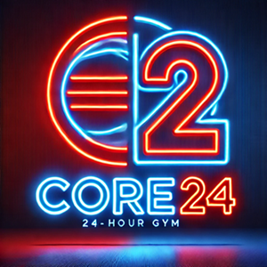

> # Core 24 Gym Customer Management System
Welcome to Core 24, the gym that never sleeps! Designed for those who live and breathe fitness, Core 24 is more than just a gym—it’s a lifestyle. Our state-of-the-art, modern facility offers a welcoming environment, well-lit workout spaces, and a team of friendly staff dedicated to supporting your fitness journey.

With our seamless online booking system, members can reserve a workout slot on any day they choose, ensuring a hassle-free experience. To maintain a comfortable and effective workout environment, we limit bookings to 50 per day—giving you plenty of space to focus on your goals.

Built with Django, the Core 24 Gym Booking System is a full-stack web application that provides:

Simple and secure user authentication for easy access
A streamlined booking process with real-time availability
An admin panel for staff to manage memberships and reservations
Whether you’re an early bird or a night owl, Core 24 is here for you 24/7. Join us and experience fitness on your terms!

> ## Project goal
The goal of the Core 24 Gym Booking System is to provide a seamless, user-friendly, and engaging platform for gym members to book workout slots with ease. Designed for a modern, 24/7 fitness facility, this system ensures a smooth and efficient booking experience while maintaining a structured daily capacity.

Key Objectives:

✅ **Enhance** User Experience – Offer a simple, intuitive interface with a low-clutter layout, ensuring easy navigation for users of all skill levels.

✅ **Ensure Availability & Fair Access** – Limit daily bookings to 50 slots per day to prevent overcrowding and create a comfortable workout environment.

✅ **Encourage User Engagement** – Provide interactive features that keep members coming back, reinforcing Core_24’s mission of making fitness a lifestyle, not just a habit.

✅ **Enable Secure & Efficient Management** – Offer an admin panel for staff to manage bookings and memberships with ease.

✅ **Promote a Modern, Stress-Free Booking Process** – Keep the interface clean, responsive, and accessible across all devices for a hassle-free experience.

This project is built with Django to showcase full-stack development capabilities, integrating authentication, database management, and staff controls in a professional, scalable, and future-proof way.

> ## Target Audience
The Core 24 Gym Booking System is designed for individuals who value convenience, efficiency, and a premium fitness experience. Whether you're a seasoned athlete or just starting your fitness journey, Core 24 makes booking a gym session simple and stress-free.

Who is this for?
🏋️‍♂️ Fitness Enthusiasts & Gym-Goers – Those who want a structured and hassle-free way to plan their workouts.

⏰ Busy Professionals & Night Owls – Members who need the flexibility of a 24/7 gym with an easy online booking system.

📱 Tech-Savvy Users & Convenience Seekers – People who appreciate a modern, interactive platform with a clean, low-clutter interface.

👥 Gym Owners & Staff – Admins who require a simple and effective management system to oversee bookings and memberships.

By focusing on a frictionless user experience, fair access to facilities, and engaging features, Core 24 helps members stay committed to their fitness goals while maintaining a well-organized gym environment.

> ## Design
The Core 24 Gym Booking System is built with a modern, minimalist, and responsive design, ensuring a smooth experience across all devices. Simplicity is at the heart of the design, keeping the interface clutter-free, intuitive, and easy to navigate while maintaining a professional and polished look.

🔹 Consistent & Professional Theme
 - A unified background theme is used throughout the platform to create a seamless user experience.
 - This cohesive design enhances navigation familiarity, making it easier for users to interact with the system across different sections.
 - The professional color scheme reflects the gym’s premium and modern feel, reinforcing Core 24’s identity as a high-end fitness facility.

🔹 Responsive & Device-Friendly
 - Fully optimized for desktop, tablet, and mobile devices, ensuring seamless usability across different screen sizes.
 - Uses flexible layouts and adaptive elements, allowing users to book sessions effortlessly whether they are on a laptop, tablet, or smartphone.
 - Employs Bootstrap for styling, ensuring responsiveness and an elegant look across all platforms.

🔹 Simplicity & User-Focused Layout
 - A low-clutter design keeps distractions to a minimum, focusing on core functionalities like booking slots, checking availability, and managing  - memberships.
 - Clear navigation makes it easy for users to book, cancel, or view gym sessions without unnecessary steps.
 - Large, touch-friendly buttons improve accessibility for mobile users.

🔹 Engaging & Interactive Features
 - Real-time feedback on booking availability encourages users to plan ahead.
 - A clean, dark-mode-friendly UI reduces strain during night-time use.
 - Interactive elements, such as confirmation pop-ups and subtle animations, enhance the user experience without slowing down performance.

🔹 Admin Panel for Efficient Management
 - A dedicated staff dashboard allows gym admins to oversee bookings, manage memberships, and ensure fair usage of the facility.
 - Built with Django, ensuring a secure and scalable back-end for future enhancements.
 - By combining a consistent background theme, sleek design, high usability, and a seamless booking experience, the Core_24 system makes fitness  planning effortless, ensuring members keep coming back for more!

> ## Features
The Core_24 Gym Booking System is packed with intuitive and user-friendly features, ensuring a smooth experience for both members and staff.

### landing Page – A Welcoming First Impression
 - A modern, eye-catching design with a sleek and professional layout.
 - Highlights the Core_24 lifestyle, showcasing the gym’s 24/7 accessibility, well-lit spaces, and friendly staff.
 - Includes a clear call-to-action to encourage users to sign up or log in and start booking immediately.

### Navigation Bar – Dynamic & User-Friendly
 - A clean, minimalistic navigation bar that adjusts based on user type:
 - Guests see options to sign up, log in, and explore gym information.
 - Logged-in members can access Bookings, Account Settings, and Logout.
 - Staff/Admin users have additional access to Booking Management and Admin Tools.
 - Designed for quick and easy navigation, making it effortless to move between pages.

### Booking Page – Hassle-Free Gym Reservations
 - Allows users to book a gym session for any available day, with a limit of 50 bookings per day to ensure a comfortable experience.
 - Displays real-time availability, so users can see how many slots are left before booking.
 - Booking confirmation is instant, with a success message to reassure the user.

### User Dashboard – Personalised for Members
 - Shows an overview of upcoming bookings, making it easy for users to track their schedule.
 - Allows members to edit or cancel bookings with just a few clicks.
 - Features a clean, clutter-free layout for maximum ease of use.

### Admin Panel – Powerful Management Tools
 - Designed for staff members to oversee gym bookings and ensure smooth operations.
 - Admins can:
 - View, add, modify, or remove bookings as needed.
 - Manage user accounts (suspensions, updates, and approvals).
 - Monitor daily booking numbers to maintain fair access to the gym.
 - Secure access to admin features ensures data integrity and member privacy.

### Responsive Design – Seamless Across All Devices
 - The system is fully optimized for desktops, tablets, and smartphones, ensuring a smooth experience no matter how users access it.
 - Touch-friendly buttons, adaptive layouts, and a mobile-first approach make booking effortless on the go.
 - With a sleek interface, dynamic navigation, and easy-to-use booking system, Core_24 makes fitness planning effortless while maintaining a premium,  modern gym experience.

>> ### **Main Menu.**

The Main Menu is the backbone of the program, giving options to branch out 
quickly and easily accessing different system areas.

>> ### **Admin area and Login**
Simple password-protected access ensures only authorized personnel can modify data.
Admin Panel: Enables staff to view, add, or remove currency stock levels.
Provides real-time updates on currency quantities to ensure accurate stock monitoring.

***Password - admin123***

 
>> ### **Admin option 1**
View/Update Exchange Rates, is an upcoming feature.

>> ### **Admin option2**
Manage Currency Stock, allows the user to add or remove stock without the need to make a sale.

>> ### **Admin option 3**
View Transaction Logs is an upcoming feature that will allow the use of currency tracking and auditing.

> ### **Customer Menu**
 Intuitive interface for customers to explore stock availability and exchange 
 rates. it also has the Till option to sell currency with the option print receipts if required.

> ### **Customer panel option 1**
 View Currency Stock, allows the user to quickly access stock records to offer information to the customer quicker and with ease.

> ### **Customer panel option 2**
Currency Exchange Rates displays up-to-date exchange rates for multiple currencies.
- Accessible to both admin’s and customers for transparency.
  Allows customers to calculate costs quickly and confidently.

- Displays up-to-date exchange rates for multiple currencies.
  Accessible to both admins and customers for transparency.
  Allows customers to calculate costs quickly and confidently.

>> ### **Customer panel option 3**
**Sales Till System**  
Customers can purchase their desired currency in real-time.
Automatically calculates the cost based on current exchange rates.
Ensures transactions are seamless and accurate.

**Printable Receipt**

After a transaction, customers have the option to print a detailed receipt.
Includes transaction details such as the purchased amount, currency, and total cost.
Enhances the professionalism of the service.

> ## Manual & Python Testing

I did manual testing to verify that the website functions as expected by executing test cases without using automation tools. This approach is essential for identifying usability issues, unexpected errors, and verifying workflows from a user perspective. at every step of the way throughout the development process. 

For my core 24 gym project, I performed manual testing by:

 - Navigating through the site to ensure all pages load correctly.
 - Testing user authentication, including login, logout, and account creation.
 - Booking system validation, where I attempted to book slots under various conditions to confirm the 50-booking limit.
 - Checking form validations to ensure required fields and error messages function correctly.
 - Admin panel functionality testing, ensuring staff could manage users and reset passwords.
 - These tests helped identify and resolve issues such as incorrect file paths and permission-related errors.

**Python Testing**

To ensure stability and correctness in my project, I implemented Python-based testing using Django’s built-in TestCase module. This allowed me to write automated unit and integration tests for critical functionalities, including:

 - User authentication tests to verify login, registration, and password reset functions.
 - Booking system tests to check that users cannot exceed the daily booking limit.
 - Database integrity tests to confirm correct data storage and retrieval.

I ran these tests using Django’s test framework with the command: python manage.py test

## Code Submission: The code was submitted to the CI tool for automated style checking.

**Review and Corrections:**
- Long lines exceeding 79 characters were identified and broken into multiple 
  lines using parentheses.
- Indentation errors and spacing issues were corrected.
- Blank lines removed

**Final Check: After making corrections, the code was re-submitted to ensure it passed all checks.**

## Development Testing

During the initial program development and testing phases, it was observed that error's were coming up as I went along here are the main issues found:

***Use of the Clear Screen Function***

- During initial testing, I observed that the terminal output resembled a continuous log, quickly becoming cluttered and overwhelming.

- To enhance readability and improve the user experience, I implemented a clear screen function. This function is utilized in menu navigation and certain program features to 
  keep the display clean and organized.

***Incorporating time.sleep(2) and Input Pauses***

Reason for Adding time.sleep(2)

- messages and prompts often disappeared too quickly, especially when the program transitioned back to the previous menu. This made it difficult for users to read and  
  understand the messages before the screen was cleared or the next menu appeared.

- To address this issue, I added time.sleep(2) pauses after certain error messages and user prompts. This function temporarily halts the execution of the program for 2 seconds, 
  giving users sufficient time to read the displayed messages.

Implementation of time.sleep(2)
The time.sleep function was imported from Python’s built-in **time** library at the beginning of the program.

***Adding "Press Enter to Continue" Prompts***

- In addition to time.sleep(2), I added "Press Enter to continue" prompts in sections where users might require more time, such as after viewing stock or exchange rates.
  This  ensures that users can take as much time as they need before moving on.

Example:
input("\nPress Enter to return to the previous menu...\n")

***Functions Revert Back to the Main Menu***

- When using set functions further inside the program, when either an invalid input or the program had completed its task it would revert back to the main menu.

- To fix this I updated the code to revert back to the previous menu or try again depending of the task at hand.

## Systematic Testing

The following tests were carried out to ensure the program operated as intended, ironing out errors at every stage.

**Invalid menu option in the main menu**

**Invalid currency input**

**Non-numeric input for currency amount**

**Purchasing more currency than available**

**Correct transaction flow**

**Admin panel password verification**

**Exit options in customer and admin panels**

 **Following the previous exit option, returns the Terminal back to a clean blank state, ready for the next command.**

> ## Deployment

**How I Deployed This Project**

This project was developed using GitPod as the Integrated Development Environment (IDE) and GitHub as the version control repository. It was deployed to Heroku to make it publicly accessible.

**Deployment Process**

1. ***Version Control with GitHub***

- https://github.com/Rick-8/TC-Go-Co
- Created a GitHub repository to store the project code.
- Used git commands (git add, git commit, git push) to track changes and push the code to the remote 
  repository on GitHub.

2. ***Development in GitPod***

- 

3. ***Preparing for Deployment to Heroku***

- 

4. ***Deploying to Heroku***

- 
  
5. ***Accessing the Application***

- The application is live and can be accessed at the following link:
- https://

> ## Credits

I am grateful for the support and guidance of my mentor throughout this project.

Additional credits:

- Project Inspiration: Derived from the I Think Therefore I Blog project, which guided me through Django.
- Flow Chart Design: Created using Lucid.app.
- : Designed with the help of ChatGPT.
- Development Tools: GitHub and GitPod for repositories and IDE.
