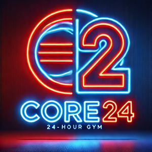
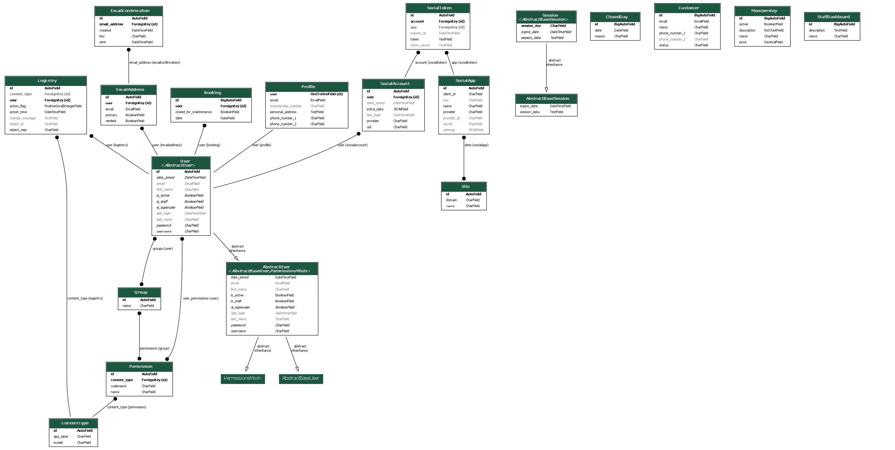
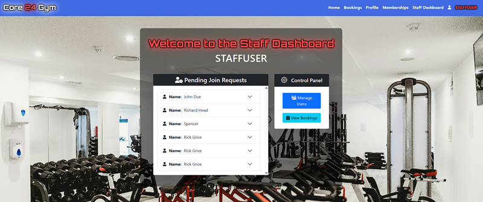
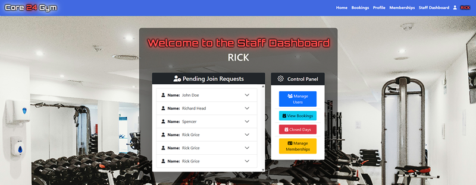
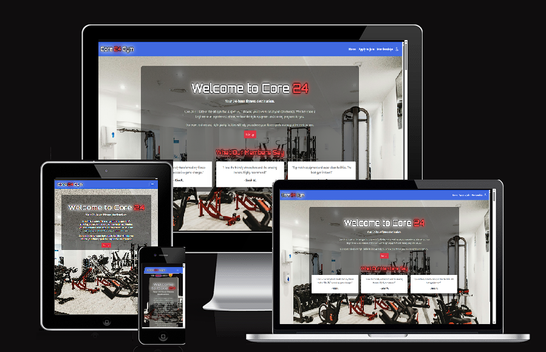

# Core 24 Gym: Elite Fitness & Social Club

Welcome to Core 24, the ultimate high-end gym and social club for serious fitness enthusiasts. 

Designed for those who are dedicated to their fitness journey, Core 24 is more than just a gym—it’s an exclusive community. Our state-of-the-art facility offers a premium workout experience, personal trainers on hand, and a private space for high-profile individuals and professional athletes to train in peace.

With our seamless online booking system, members can reserve a workout slot on any day they choose, ensuring a hassle-free experience. To maintain a comfortable and effective workout environment, we limit bookings to 50 per day—giving you plenty of space to focus on your goals. Additionally, all sign-ups are vetted by staff before enrolment to ensure privacy, security, and a personalised experience for our members.

Built with Django, the Core 24 Gym Booking System is a full-stack web application that provides:

- Simple and secure user authentication for easy access

- A streamlined booking process with real-time availability

- An admin panel for staff to manage memberships and reservations

- A private, secure environment for all members

Whether you’re an elite athlete, a fitness professional, or simply someone who values a premium workout experience, Core 24 is here for you 24/7. Join us and train in exclusivity!

[Visit Core 24 Gym](https://core24-62ff6f5b0560.herokuapp.com/)

## Project Goal
The Core 24 Gym Booking System provides a seamless, secure, and professional online reservation system for members to book their training sessions with ease.

### Key Objectives:
✅ **Elite Member Experience** – A premium, minimal-clutter platform designed for high-end clientele who value efficiency and ease of use.  
✅ **Exclusive Training Environment** – Limited daily bookings ensure an optimal training space free from overcrowding.  
✅ **Personalized Services** – Members can request personal trainers and private sessions at anytime with ease.  
✅ **Efficient Management** – A dedicated admin panel for managing memberships, bookings, and profile information.  
✅ **Security & Privacy** – Strong authentication ensures that only registered members can access the system, prioritizing the safety of our elite clientele.  

## Target Audience
### Core 24 caters to:
🏋️‍♂️ **Serious Gym Enthusiasts & Athletes** – Those who demand the highest quality in equipment, space, and personal coaching.  

📢 **High-Profile Individuals** – Celebrities, executives, and public figures who value a discreet training experience.  

👥 **Exclusive Social Club Members** – Fitness lovers who want to be part of a high-end, like-minded community.  

📅 **Busy Professionals** – Members who require 24/7 access and a seamless booking system to fit their schedule.  

## Design & User Experience
- Flow chart [View Flow Chart](https://lucid.app/lucidspark/556d2b37-ef2f-466c-83d1-129fe27d5738/edit?viewport_loc=-19006%2C-4815%2C35574%2C16879%2C0_0&invitationId=inv_f9b06894-974b-42cc-84dd-d7fad332391d)

- Models Map - 

- Minimalist & High-End Aesthetic – The design focuses on sleek, modern aesthetics with a premium look and feel, aligning with the exclusive nature of the gym.

- Intuitive Navigation – A simple and straightforward interface ensures that members can quickly book sessions, view availability, and manage their accounts with minimal effort.

- Mobile-Optimized Experience – Fully responsive across devices, ensuring a smooth and accessible experience whether on desktop, tablet, or mobile.

- Privacy-Focused Design – Members’ privacy is a top priority, with an emphasis on secure access and personalized user interfaces, providing a seamless, private, and exclusive gym experience.

### 🔹 Premium & Consistent Theme
- A sleek, high-end design reflects the exclusivity of Core 24.
- Professional color schemes, minimalistic layout, and luxury aesthetics.
- Consistent user interface for easy navigation.

### 🔹 Responsive & Device-Friendly
- Fully optimized for desktops, tablets, and smartphones.
- Adaptive design ensures smooth interaction across all platforms.

### 🔹 Simple & Intuitive Booking System
- Members can book gym slots effortlessly.
- Real-time slot availability ensures fair and structured access.

### 🔹 Admin Panel for Gym Management
- Secure dashboard for staff to oversee bookings, memberships, and profiles.
- Django-powered backend ensures stability and scalability.

## Features

### ✨ Landing Page – First-Class Experience

- A visually appealing introduction to Core 24’s premium offerings.
- Showcases the gym’s high-end facilities, trainers, and exclusive membership benefits.
- Easy access to sign-up and login options.
- The navigation bar on this page will display sign-up and login options for users who are not logged in. Once a user is logged in, their profile and booking options will replace these links.

### 👤 Booking System & Personalized Access – Streamlined & Efficient

 **Logged out**

 **User Logged in**

 **Superuser/Staff Logged in**

- The Log in/out symbol changes to help identify status
- Members can book a workout session in advance, with limited daily slots.
- Personal training sessions can be scheduled.
- Instant booking confirmation with email notifications.
- Booking links will only be visible to logged-in users. Admin and staff users will have additional booking management options.
- View, create, and cancel bookings with ease.
- The member dashboard will only be accessible to logged-in users. Staff users will have admin functionalities such as managing member profiles and viewing all bookings.

### 🛠️ Admin Panel – Full Control for Staff

 **Staff User**

 **Super User**

- Manage bookings, personal training schedules, and membership status.
- Oversee member activity and ensure smooth gym operations.
- Reset passwords and manage user access permissions.
- The admin panel will only be visible to staff users and admins, ensuring that unauthorized users cannot access sensitive data.

### 📱 Responsive & Secure System

- Built for mobile and desktop use.
- Strong authentication via **Django allauth**.  
- The system is designed to work seamlessly across all devices. The authentication process ensures that only authorized users can access certain features, with visibility of links dynamically changing based on the user’s login status (e.g., sign-up/login for logged-out users, profile/dashboard for logged-in members, and admin functionalities for staff).

## Testing & Quality Assurance
### 🔍 **Manual Testing**
- Verified all navigation links, buttons, and pages load correctly.
- Ensured authentication works as expected (login, logout, sign-up).
- Tested booking limits and error handling for full slot scenarios.
- Validated form fields and error messages.

### 🧪 **Python-Based Automated Testing**
- Used Django’s **TestCase** module to verify:
  - User authentication processes.
  - Booking system constraints (ensuring max limit is enforced).
  - Database integrity for user data and reservations.

## Deployment
### **Steps for Deployment**
1️⃣ **Version Control with GitHub** – The project is managed through GitHub for version tracking.  
2️⃣ **Local Development in VS Code** – Built and tested locally before deployment.  
3️⃣ **Preparing for Heroku Deployment**
   - Installed necessary dependencies.
   - Configured environment variables.
   - Set up PostgreSQL database for production.
4️⃣ **Deploying to Heroku**
   - Created Heroku app and connected it to GitHub repository.
   - Ran migrations and collected static files.
   - Deployed and verified successful launch.
5️⃣ **Live Application**
   - The application is live at: **[(https://core24-62ff6f5b0560.herokuapp.com/)]**

## Credits
🙏 **Acknowledgments:**
- **Mentor Support** – Guidance throughout the project.
- **Inspiration** – Inspired by professional gym management systems and Django projects.
- **Tools Used:**
  - **Lucid.app** for flowchart design.
  - **Bootstrap & FontAwesome** for UI enhancements.
  - **GitHub & VS Code** for development and version control.
  
---
With **Core 24**, fitness is more than just a routine—it’s an exclusive experience. 💪🔥

